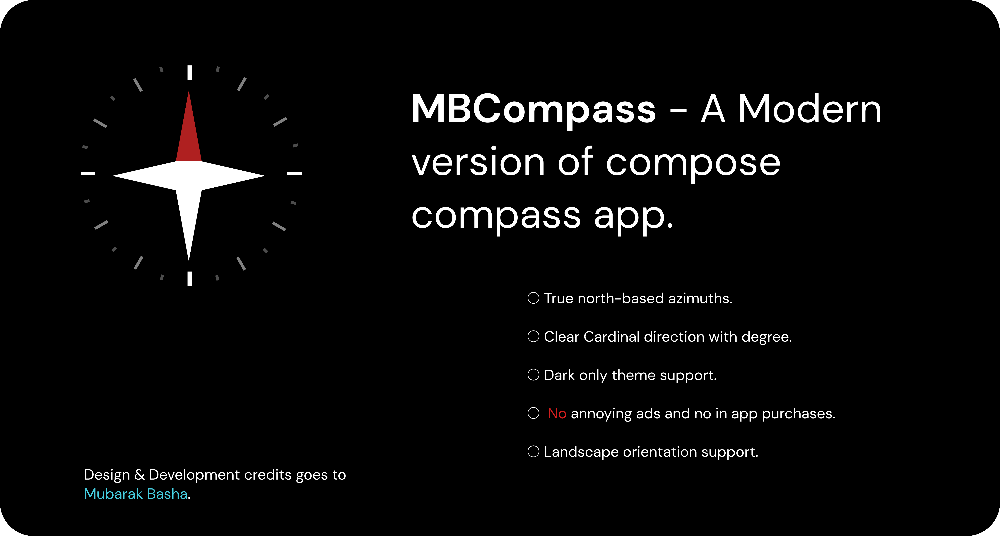
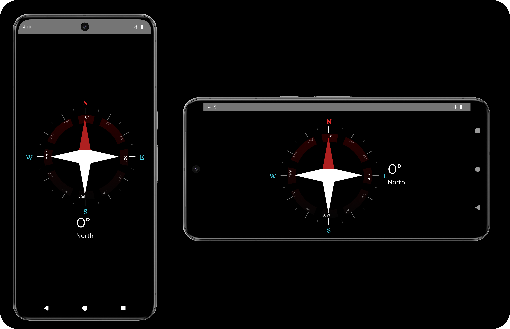
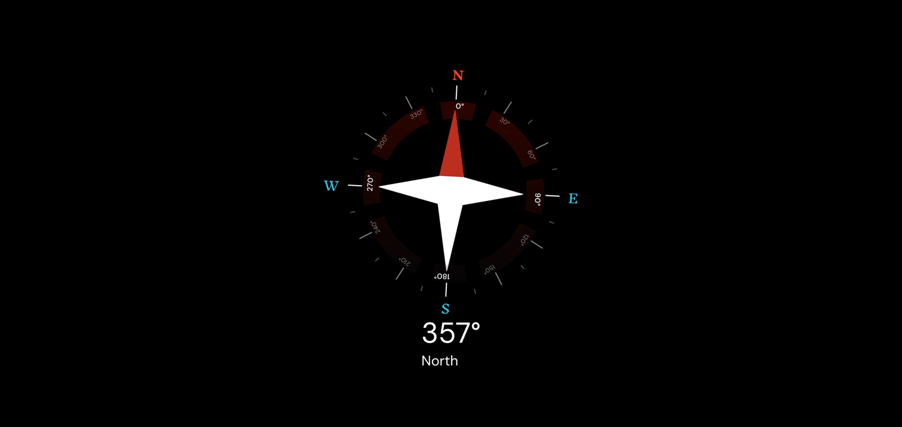

## 🧭MBCompass - Compose Compass App

### Download

Get it on [IzzyOnDroid](https://apt.izzysoft.de/fdroid/index/apk/com.mubarak.mbcompass)

Download it from github [releases](https://github.com/MubarakNative/MbCompass/releases/)

### A fully functional compose compass app that uses device magnetometer to find cardinal direction

### Features ✨

- True north-based azimuths.
- Always on display
- Landscape orientation support.
- Clear Cardinal direction degree with custom image.
- Dark only theme support.
- No annoying ads and no in app purchase

### Tech stack 🧱

- UI (`Jetpack compose`).
- Flow Layout
- Android architecture component (`ViewModel`)
- Lifecycle compose android.
- Kotlin `flows`

### License
Compass Style: MBCompass Style © 2024 by Mubarak Basha is licensed under CC BY-SA 4.0 