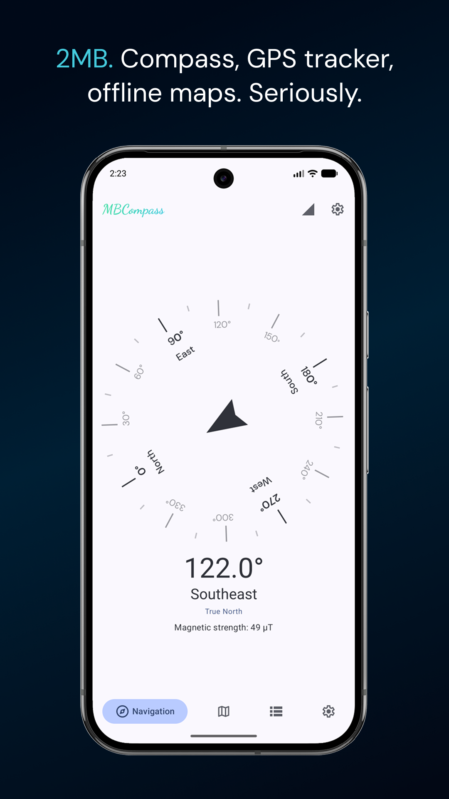
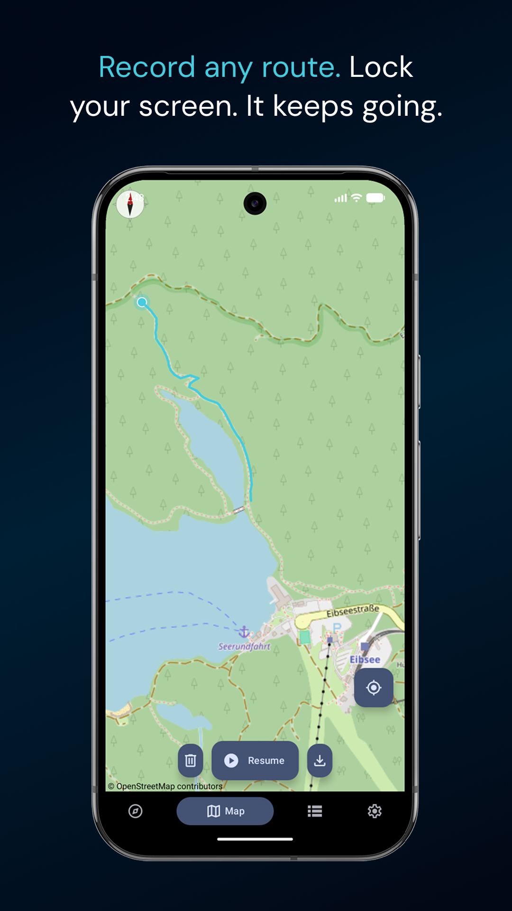
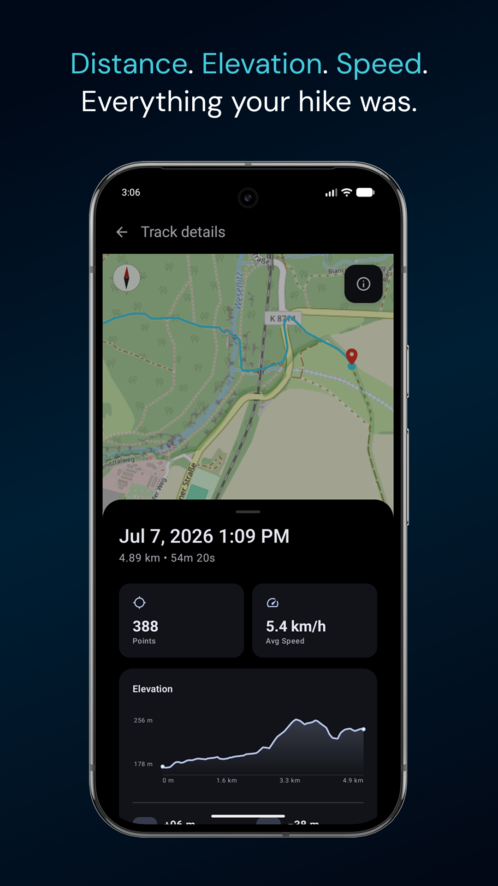
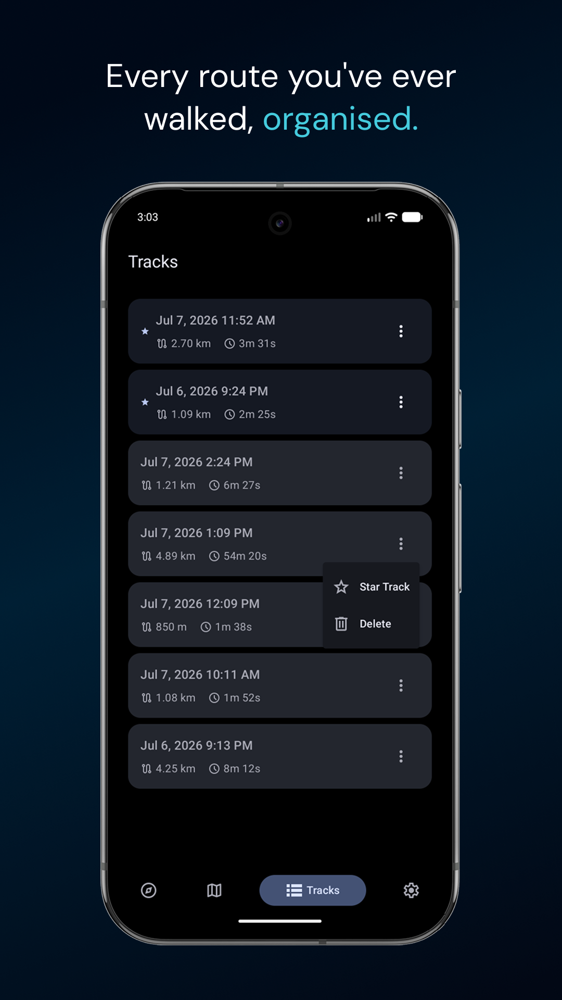
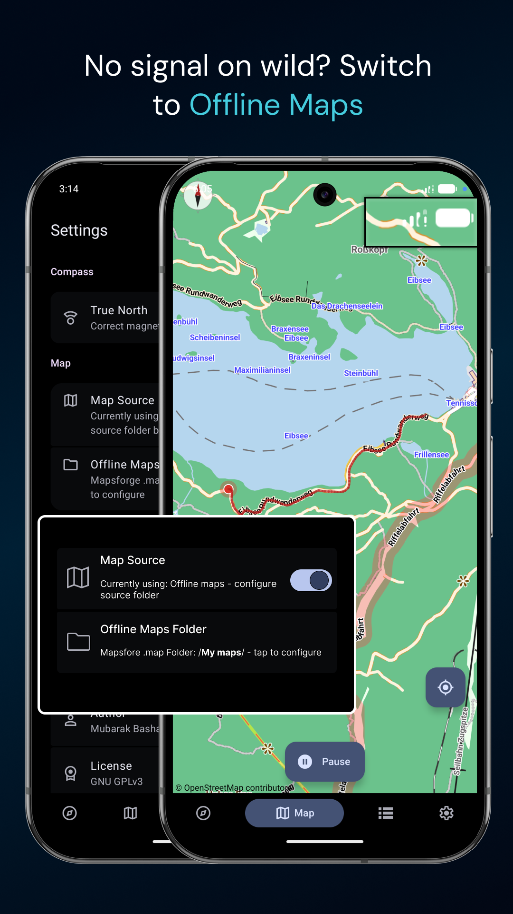
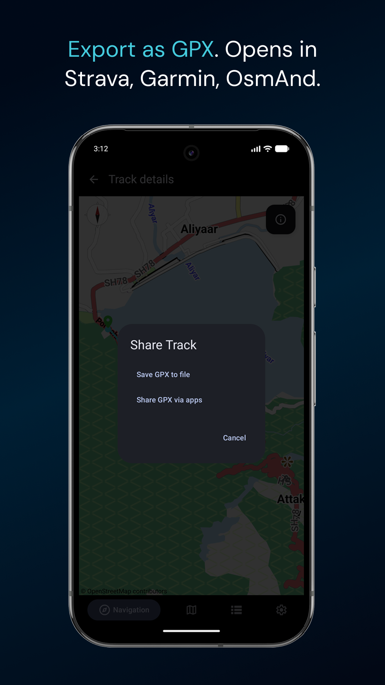

  

<h3 align="center">Modern FOSS Compass and Navigation app for Android</h3>

 
  
  
  

<h4 align="center">
  <a href="/CONTRIBUTING.md">Contribute</a> | 
  <a href="https://github.com/MubarakNative/MBCompass/blob/main/LICENSE">License</a>
</h4>

  
  
  

## About

**MBCompass** is a modern, free, and open-source compass and navigation app built from the ground up for Android, without **ads**, **IAP**, or **tracking**. Built with Jetpack Compose, it supports compass and navigation features while being **lightweight**, simple and battery-efficient.

>Not just a compass. Not a full navigation app.
>
>MBCompass sits in between, a focused **navigation utility** for hiking, trekking and everyday use, combining direction, live location, and track recording without unnecessary complexity.

---

  
  
  

  
  
  

## Features

### Compass & Navigation
- Accurate compass with both **magnetic north** and **true north**
- Sensor fusion for improved accuracy (_accelerometer_, _magnetometer_, _gyroscope_)
- Displays real-time magnetic field strength (**µT**)
- Live **GPS location tracking** on OpenStreetMap
- Keeps screen on during navigation

### Tracking & Waypoints
- **Real-time track recording** on the map (start, pause, resume)
- Smooth polyline rendering for clear path visualization
- Reliable tracking using Android’s native location APIs

### Track Analysis & Management
- View and organize all saved tracks in one place
- **Track statistics**:
  - Distance, duration, average speed
  - Elevation gain/loss
  - Min/max altitude
- **Star and sort tracks** for easy organization

### Export & Sharing
- Export tracks as **GPX files** using the system file picker
- Share tracks easily via Android share sheet

### App Experience
- Light, Dark, and **AMOLED** themes
- Extremely Lightweight (<2 MB) & Battery efficient
- Landscape orientation support
- Clean UI with Jetpack Compose (Material Design)
- Custom bottom bar for easy navigation

### Privacy First
- **No ads, no tracking, no in-app purchases**
- No Google Play Services dependency
- Uses native Android location APIs
- Supports Android 6.0+

---

## Upcoming (MBCompass Q2 Roadmap & Design Preview)

  
<strong>Planned improvements and features currently under active development</strong>

   

  

    
  

- Offline maps (vector tile based, lightweight approach under evaluation)
- Topographic (topo) map support
- Navigation UX improvements and refinements

---

## Recognition

MBCompass has gained recognition from the global developer community:

-  #13 Product of the Day on Product Hunt
-  Featured in two consecutive issues of Android Weekly
-  Reached the front page of Hacker News

[See full highlights](./Featured.md)

## Permissions

MBCompass only requests the minimum permissions required for navigation and tracking features:

- **Location**
  - Used to detect and display your current location on the map
  - Required for real-time track recording and navigation features

- **Notification (Android 13+)**
  - Used to show foreground service notifications during active tracking
  - Enables track progress visibility and quick controls (pause/resume)

- **Activity Recognition (Android 10+)**
  - Used to improve tracking accuracy by detecting user movement state (e.g., walking)

MBCompass does **not** collect, store, or share any personal data.
All location and tracking data stays on your device unless you explicitly export it (e.g., GPX files).

## Translations

MBCompass is open for **community translations** on [Weblate](https://hosted.weblate.org/engage/mbcompass/)!  
You can help make the app accessible to more users by translating it into your language.

##  Contributing

Contributions are welcome! If you encounter bugs or have feature suggestions, please open an issue or submit a pull request. See [Contributing Guidelines](CONTRIBUTING.md) for details.

## Support

Open-source projects couldn’t survive in the long run without donations or funding.

**MBCompass** is an independent, fully open-source project free of ads, trackers, and in-app purchases.
If you find it useful, consider supporting its continued development and maintenance:

Find more info on [MBCompass page](https://compassmb.github.io/MBCompass-site/donate.html)

Your support directly helps:

* Publish MBCompass on Google Play
* Improve navigation features and overall user experience
* Support lightweight vector map hosting and related infra
* Maintain performance, reliability, and long-term updates

Every contribution helps keep MBCompass independent, privacy-focused, and continuously improving for everyone. Thank you.

## License

MBCompass is Free Software: you can use, study, share, and improve it at your will. You may use, modify, and redistribute this project only if your modifications remain open-source under the same license.

> Proprietary use, commercial redistribution, or publishing modified versions with ads or tracking is strictly prohibited under GPLv3 or later.

>[!NOTE]
> **AI Notice**
> Due to the increasing use of AI/LLM tools in modifying and redistributing FOSS projects, this notice is provided for clarity.
>
> Redistributing this project (modified or unmodified) **without proper attribution** is a violation of the GPL-3.0 license.
>
> This includes cases where modifications are made using AI/LLM tools.
>
> All redistributions must retain copyright notices, provide attribution, and indicate changes.

See more information [here](https://github.com/MubarakNative/MBCompass/blob/main/LICENSE).

###  Artwork License:
Compass rose : [MBCompass rose](https://github.com/MubarakNative/MBCompass/blob/main/app/src/main/res/drawable/mbcompass_rose.xml) © 2025 by Mubarak Basha is licensed under **CC BY-SA 4.0**