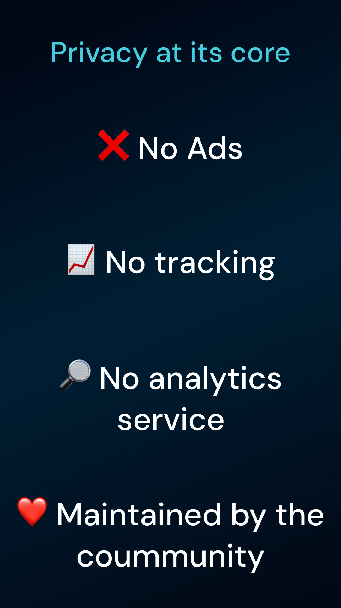

  

<h3 align="center">Modern FOSS Compass and Navigation app for Android</h3>

 
  
  
  

<h4 align="center">
  <a href="/CONTRIBUTING.md">Contribute</a> | 
  <a href="https://github.com/MubarakNative/MBCompass/blob/main/LICENSE">License</a>
</h4>

  
  
  
  

## About

**MBCompass** is a modern, free, and open-source compass and navigation app built from the ground up for Android, without **ads**, **IAP**, or **tracking**. Built with Jetpack Compose, it supports compass and navigation features while being **lightweight**, simple and battery-efficient.

>Not just a compass. Not a full navigation app.
>
>MBCompass sits in between, a focused **navigation app** for hiking, trekking and everyday use, combining direction, live location, and track recording without unnecessary complexity.

---

  
  

  
  

  
  

## Features

### Navigation

- Compass with true and magnetic north
- Live GPS location
- Sensor fusion
- Magnetic field indicator

### Maps & Tracks

- Live track recording with start, pause, and resume
- Real-time path visualization
- GPX export
- Offline Mapsforge maps (toggled in settings)
- Optional online OpenStreetMap tiles
- Track statistics (distance, duration, speed, elevation, altitude)

### App

- Material Design 3
- Light, Dark, and AMOLED themes
- Landscape support
- No ads, tracking, or in-app purchases
- Lightweight (~2 MB)
- Android 6 and above

## Roadmap

  
<strong>Q2 planned features</strong>

   

- Topographic map support (contours)
- Bearing to waypoint
- Gpx import

---

## Recognition

MBCompass has gained recognition from the global developer community:

-  #13 Product of the Day on Product Hunt
-  Featured in two consecutive issues of Android Weekly
-  Reached the front page of Hacker News
-  OSM newsletter

[See full highlights](./Featured.md)

## Permissions

- **Location** : Navigation and track recording
- **Notifications (Android 13+)** : Foreground tracking service

MBCompass never collects or shares your data.

## Translations

MBCompass is open for **community translations** on [Weblate](https://hosted.weblate.org/engage/mbcompass/)!  
You can help make the app accessible to more users by translating it into your language.

##  Contributing

Contributions are welcome! If you encounter bugs or have feature suggestions, please open an issue or submit a pull request. See [Contributing Guidelines](CONTRIBUTING.md) for details.

## Support

MBCompass is developed independently and will always remain free, open source, and ad-free.

If you find it useful, consider supporting its continued development.

[Support MBCompass](https://compassmb.github.io/donate.html)

## License

MBCompass is Free Software: you can use, study, share, and improve it at your will. You may use, modify, and redistribute this project only if your modifications remain open-source under the same license.

> Proprietary use, commercial redistribution, or publishing modified versions with ads or tracking is strictly prohibited under GPLv3 or later.

>[!NOTE]
> **AI Notice**
> Due to the increasing use of AI/LLM tools in modifying and redistributing FOSS projects, this notice is provided for clarity.
>
> Redistributing this project (modified or unmodified) **without proper attribution** is a violation of the GPL-3.0 license.
>
> This includes cases where modifications are made using AI/LLM tools.
>
> All redistributions must retain copyright notices, provide attribution, and indicate changes.

See more information [here](https://github.com/MubarakNative/MBCompass/blob/main/LICENSE).

###  Artwork License:
Compass rose : [MBCompass rose](https://github.com/MubarakNative/MBCompass/blob/main/app/src/main/res/drawable/mbcompass_rose.xml) (c) 2025 by Mubarak Basha is licensed under **CC BY-SA 4.0**