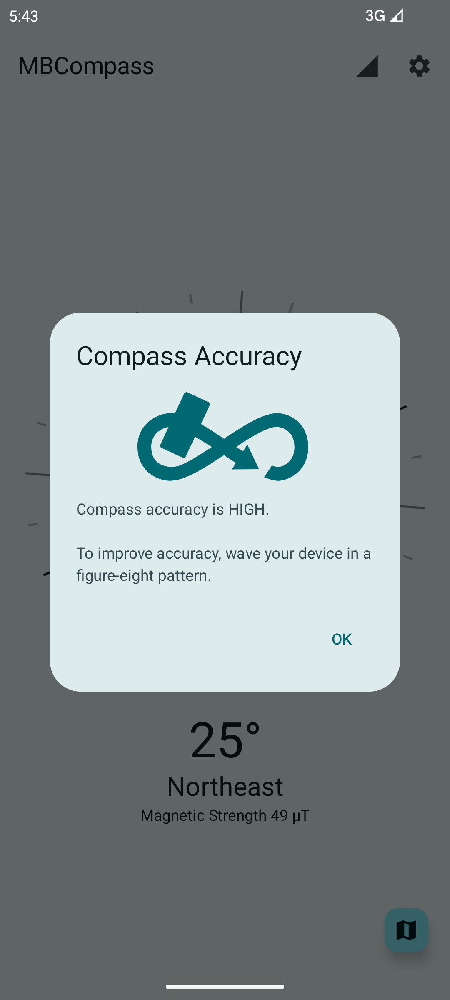
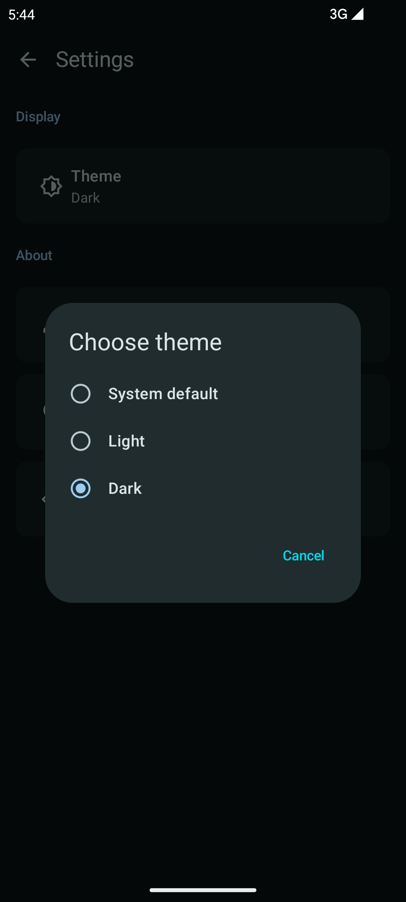

  

<h1 align="center"><b>🧭 MBCompass - Android Compass App</b></h1>
<h3 align="center">A feature-rich, ad-free compass app for Android</h3>

 
  
  
  

  
  
  

<h4 align="center">
  <a href="https://mubaraknative.github.io/">Author</a> | 
  <a href="https://github.com/MubarakNative/MBCompass/blob/main/LICENSE">License</a>
</h4>

  
  
  

## About

MBCompass is a simple yet feature-rich compass app for Android, built with Jetpack Compose. It uses the device’s magnetometer and accelerometer to provide real-time geomagnetic field updates. Designed with Android Lifecycle in mind, In general, a **modern and efficient compass**.

> Most compass apps are either too basic or bloated with ads.  
> **MBCompass** was created to fix that: lightweight, accurate, and ad-free.

---

## Screenshots 📸

  
  

  
  

  
  

## Features ✨

- Magnetic north-based [azimuths](https://en.wikipedia.org/wiki/Azimuth).
- Ability to show the user's current location using [OpenStreetMap](https://openstreetmap.org).
- Light / Dark Theme support.
- Display Magnetic Strength in µT.
- Keep the screen on support.
- Landscape orientation support.
- Smooth compass rotation.
- Sensor fusion: Combines (Accelerometer, Magnetometer, and Gyroscope) for better accuracy.
- No annoying ads or in-app purchases.

##  Permissions 🔐

- Location permission is only used to detect the current location on the map.

##  Contributing 🤝

Contributions are welcome! If you encounter bugs or have feature suggestions, please open an issue or submit a pull request. See [Contributing Guidelines](CONTRIBUTING.md) for details.

## License 📄

MBCompass is Free Software: you can use, study, share, and improve it at your will. You may use, modify, and redistribute this project only if your modifications remain open-source under the same license.

> Proprietary use, commercial redistribution, or publishing modified versions with ads or tracking is strictly prohibited under GPLv3 or later.

See more information [here](https://github.com/MubarakNative/MBCompass/blob/main/LICENSE).

###  Artwork License: 🎨
Compass rose : [MBCompass rose](https://github.com/MubarakNative/MBCompass/blob/main/app/src/main/res/drawable/mbcompass_rose.xml) © 2025 by [Mubarak Basha](https://mubaraknative.github.io) is licensed under CC BY-SA 4.0