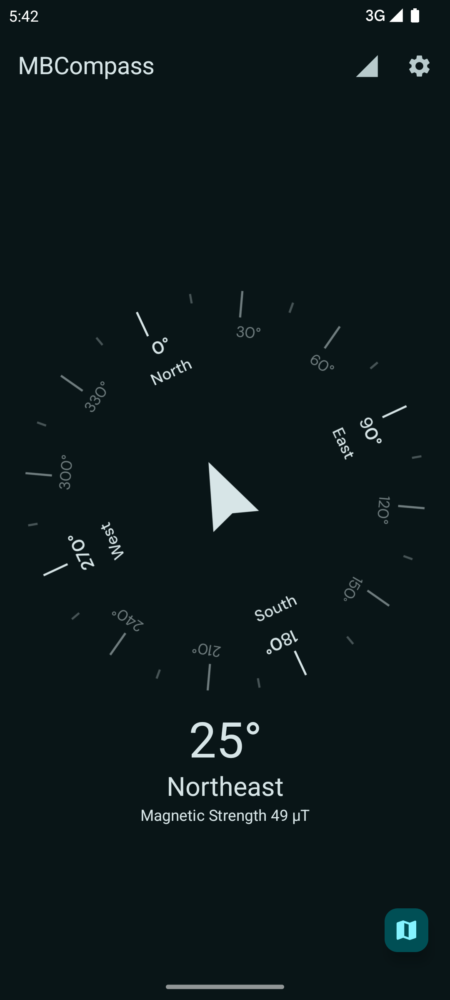

<h1 align="center"><b>🧭MBCompass</b></h1>
<h4 align="center">A fully functional jetpack compose compass app.</h4>

    
    
    

<h4 align="center"><a href="https://mubaraknative.github.io/">Author</a> | <a href="https://github.com/MubarakNative/MBCompass/blob/main/LICENSE">License</a></h4>

    
    

## About

MBCompass is a simple yet featurish compass app built with Jetpack Compose. It uses the device's magnetometer and accelerometer to provide real-time geomagnetic field updates. Designed with Android Lifecycle in mind, it delivers a simple and efficient app experience. In general, a **simple and efficient compass**

> Most compass apps are either too basic or bloated with ads.  
> **MBCompass** was created to fix that — lightweight, accurate, and totally ad-free.

---

## Screenshots

    
    
    

## ✨Features

- Magnetic north-based [azimuths](https://en.wikipedia.org/wiki/Azimuth).
- Ability to show user current location using [OpenStreetMap](https://openstreetmap.org).
- Light / Dark Theme support.
- Display Magnetic Strength in µT.
- Keep screen on support.
- Landscape orientation support.
- Smooth compass rotation.
- Sensor fusion: Combines (Accelerometer, Magnetometer and Gyroscope) for better accuracy.
- No annoying ads or no in-app purchase.

## 🔐 Permissions

- Location permission only used to detect current location on map.

## 🤝 Contributing

Contributions are welcome! If you encounter bugs or have feature suggestions, please open an issue or submit a pull request.

## 📄License

MBCompass is Free Software: You can use, study share and improve it at your will. Specifically you can redistribute and/or modify it under the terms of the GNU General Public License as published by the Free Software Foundation, either version 3 of the License, or (at your option) any later version.

See more information about [here](https://github.com/MubarakNative/MBCompass/blob/main/LICENSE).

### 🎨 Artwork License:
Compass rose : [MBCompass rose](https://github.com/MubarakNative/MBCompass/blob/main/app/src/main/res/drawable/mbcompass_rose.xml) © 2025 by [Mubarak Basha](https://mubaraknative.github.io) is licensed under CC BY-SA 4.0

