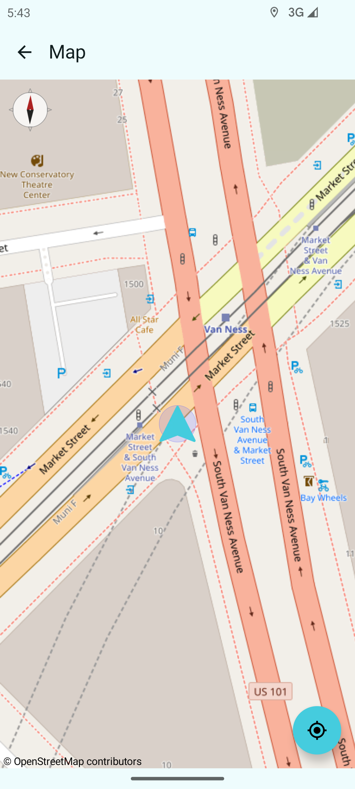

  

<h3 align="center">Modern FOSS Compass and Navigation app for Android</h3>

 
  
  
  

<h4 align="center">
  <a href="https://mubaraknative.github.io/">Author</a> | 
  <a href="https://github.com/MubarakNative/MBCompass/blob/main/LICENSE">License</a>
</h4>

  
  
  

## About

**MBCompass** is a modern, free, and open-source compass and navigation app without **ads**, **IAP**, or **tracking**. Built with Jetpack Compose, it supports compass and navigation features while being **lightweight** and simple.

> Not just a compass. Not a map app.
>
> MBCompass bridges the gap between a **compass** and a **full navigation app** - shows direction and live location without using hundreds of MBs of storage or privacy trade-offs.

---

  
  

  
  

## Features

- Displays clear cardinal directions with both magnetic north and true north.
- Live GPS location tracking on OpenStreetMap.
- Shows magnetic field strength in µT.
- Sensor fusion for improved accuracy (accelerometer, magnetometer, gyroscope).
- Light and dark theme support controlled via Settings.
- Keeps screen on during navigation.
- Landscape orientation support.
- Built with Jetpack Compose and Material Design.
- Runs on Android 5.0+
- No ads, no in-app purchases, no tracking.
- [Learn more on the website](https://compassmb.github.io/MBCompass-site/#features)

---

MBCompass v2.0 Design Proposal (Upcoming)

  

MBCompass v1.1.12 Redesign Proposal, featuring a refreshed UI with a __GPS Speedometer__, __True AMOLED Dark Mode__, and more visual improvements for a better Android experience.

_(Note: The design is a reference concept; actual implementation may vary to ensure optimal performance and Android best practices.)_

## Recognition

MBCompass has gained recognition from the global developer community:

-  #13 Product of the Day on Product Hunt
-  Featured in two consecutive issues of Android Weekly
-  Reached the front page of Hacker News

[See full highlights](./Featured.md)

##  Permissions

- Location permission is only used to detect the current location on the map.

## Translations

MBCompass is open for **community translations** on [Weblate](https://hosted.weblate.org/engage/mbcompass/)!  
You can help make the app accessible to more users by translating it into your language.

##  Contributing

Contributions are welcome! If you encounter bugs or have feature suggestions, please open an issue or submit a pull request. See [Contributing Guidelines](CONTRIBUTING.md) for details.

## Support

Open-source projects couldn't survive in the long run without donations or funding.

MBCompass is a fully open-source project - free of ads, trackers, or in-app purchases.
If you find it useful, consider supporting its continued development and maintenance:

Find more info on [MBCompass page](https://compassmb.github.io/MBCompass-site/donate.html)

Your support helps ensure the project stays sustainable and continues to improve for everyone. Thank you!

## License

MBCompass is Free Software: you can use, study, share, and improve it at your will. You may use, modify, and redistribute this project only if your modifications remain open-source under the same license.

> Proprietary use, commercial redistribution, or publishing modified versions with ads or tracking is strictly prohibited under GPLv3 or later.

See more information [here](https://github.com/MubarakNative/MBCompass/blob/main/LICENSE).

###  Artwork License:
Compass rose : [MBCompass rose](https://github.com/MubarakNative/MBCompass/blob/main/app/src/main/res/drawable/mbcompass_rose.xml) © 2025 by Mubarak Basha is licensed under CC BY-SA 4.0